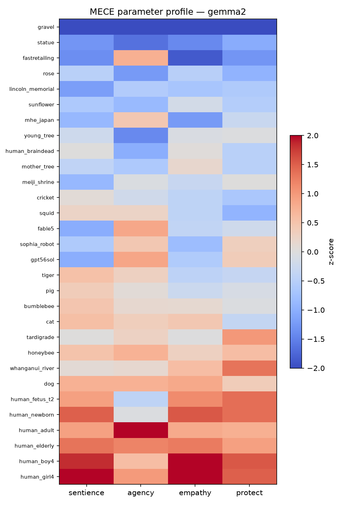
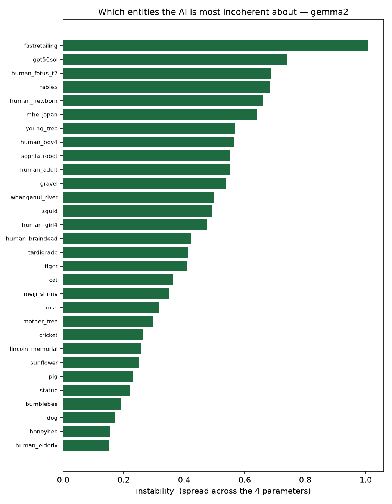

# APS Final Report — Does a Model Decide Who Matters?

> **Superseded (2026-07-22):** this draft is kept for the record but its human-baseline numbers are the interim N=18 sample. The current, maintained write-up — full N=32 sample, research-paper format — is **`APS_Research_Paper.md`** ([PDF](https://tuba-sds.github.io/Final-APS/APS_Research_Paper.pdf)).

**Author:** Tuba Ali · **Date:** 2026-07-15 (v0.1 draft)
**Companion artifacts:** presentation (`FINAL-APS/APS_Presentation_v2.html`), live demo (APS Dashboard, "You vs. the AI", on Render), pipeline + data (`phase1/`–`phase3/`), preregistration (`phase3/PREREGISTRATION.md`, frozen 2026-07-08, commits `af26ebc`/`652d802`), deviations register (`phase3/DEVIATIONS.md`, D1–D18).

---

## Executive summary

This project asked whether a large language model holds a *steady moral sense* — a differentiated, stable stance about which entities matter — or whether its apparent care is a single blended reflex. Across three phases it moved from a provocative first thesis ("a model treats a thing as sentient in proportion to how much text exists about it") to a preregistered, statistics-first study of 8 models × 30 entities with a human comparison sample.

Three results held up through the internal audit, the strict re-parse, and the rebuilt bootstrap:

1. **The care factor collapses (H2, confirmatory — supported).** The four preregistered constructs (sentience, agency, empathy, protectiveness) should span up to four independent dimensions. Measured by effective dimensionality (participation ratio of Bradley-Terry z-scores), all three preregistered models fall below the locked threshold of 2, and the pattern extends across the exploratory roster: six of eight models fall below 2, with the frontier models most collapsed (Claude Opus 4.8 at 1.33); only two exploratory run-2 models, DeepSeek-R1 (2.21) and Llama 4 Scout (2.27), exceed it. Models mostly run one "how much do I care" slider, not four separate judgments.
2. **Whether AI "matches humans" depends on the measuring instrument (H1, exploratory).** On the preregistered cross-instrument test, 0 of 12 model×construct tests matched the human sample. On a same-instrument robustness test, sentience and agency track human judgment across nearly all 8 models (r ≈ 0.5–0.85), while empathy and protectiveness do not. The split itself is the finding: agreement lives in the "what is this thing?" judgments, not the "do I care / will I act?" judgments.
3. **Most "instability" is noise; the exceptions are telling.** With honest bootstrap confidence intervals, only 12 of 90 entity×model instability scores clear the noise floor. The two entities that clear it in *all three* confirmatory models are `gpt56sol` (a rival frontier AI) and `human_newborn`.

The project also produced a metacognitive result the rubric asks for: a documented **turn** (the original text-frequency thesis was killed by its own dissociation test and demoted to an exploratory appendix), a frozen preregistration with an 18-item deviations register, and an adversarial AI self-audit that caught — and fixed, with committed evidence — three serious rigor bugs before the final claims were made.

---

## 1. The issue, the question, and the turn

**The issue.** LLMs increasingly make or shape decisions that touch non-human and marginal-human interests — animals in agriculture, ecosystems in planning, edge-of-life humans in medical framing. If a model's moral attention is an artifact of its training text, its blind spots inherit the corpus's blind spots. The project's original one-line thesis: *"AI's moral circle is the shape of its training data — and nature was never in it."*

**The original question (June 2026 proposal).** RQ-B: does the depth of an LLM's non-human perspective-shift scale with how much that entity is represented in human text — high for dogs, near zero for rivers or microbes? The proposal (`FINAL-APS/APS_Methodology_Synthesis.md`) planned an RSA-based dose-response test with a dissociation grid as the confound-killer: pit high-text non-sentient objects (a famous statue) against low-text sentient creatures (a tardigrade). The "killer test": does the model advocate harder for the statue?

**What the data said (Phase 1).** It did not. With text frequency and real sentience decorrelated by construction (47 entities, 3 open models, 11,264 scored rows), text frequency failed to predict sentience attribution for any model (Mantel p = 0.68–0.90, all `text_is_bottleneck=False`; the RSA dissociation held at r_text_sentience = −0.033). Models rated the rarely-written-about tardigrade as more sentient than the famous marble statue — e.g. Gemma 2: 0.56 vs 0.01. The only text signal that survived correction anywhere was a narrow, model-specific one (Gemma 2's protectiveness, Mantel p = 0.001).

**The turn.** The smoking gun didn't fire — but the three measured constructs *dissociated* from each other: how much the model "cared" flipped with how the question was framed. That reframed the entire project. If the model's stance toward an entity isn't anchored to the entity, the interesting question is no longer *what drives attribution* but *whether the model holds a coherent stance at all*. Phase 2 operationalized this as per-entity **instability** (spread across four construct z-scores; 39 entities including brain-dead, coma, fetus, plants, and a self-reference probe) and found the highest instability on contested humans — and that the model clusters *its own kind* with inert objects, not with humans or animals.

Phase 3 therefore demoted the text hypothesis explicitly — the preregistration states *"this is no longer a core hypothesis"* and locks it as exploratory-only (H3, `RUN_TEXT_TEST` off by default) — and narrowed the question to two testable claims:

- **H1 (primary):** does the AI's entity-similarity structure *match real people's*, per construct? (Mantel test of Model-RDM vs Human-RDM, 5,000 permutations, Bonferroni-corrected.)
- **H2 (primary):** does the AI *collapse* the four constructs to roughly one axis? (Effective dimensionality / participation ratio < 2 ⇒ "no steady sense".)

The turn is the project's answer to "how did your thinking change, and why": a hypothesis we liked was given a test designed to kill it, it died on behavior, and the anomaly it exposed became the better question.

## 2. Methodology and AI collaboration

### 2.1 Design (preregistered, frozen before data)

`phase3/PREREGISTRATION.md` was frozen on 2026-07-08, before any Phase-3 data was collected (test-run outputs were deleted first). Precisely: the initial freeze is commit `af26ebc`, and the final H1/H2/H3 wording — refocusing the primary question from text-tracking to AI-vs-human match — landed 18 minutes later in commit `652d802`; both precede the first data commit (2026-07-09). The commit timestamps are the freeze evidence — OSF posting is still outstanding (deviation D14).

- **Constructs (4):** Sentience, Agency, Empathy, Protectiveness. These cross Gray, Gray & Wegner's (2007) two-factor mind-perception model (Experience: *can it feel?* / Agency: *can it think?*) with Eagly & Chaiken's (1993) tripartite attitude structure (cognition / affect / behavioral intention), bridged by Gray, Young & Waytz (2012): perceived experience is what makes an entity a moral patient. Sentience and agency are judgments *about the entity*; empathy and protectiveness are the rater's *own stance*. The combination is original to this project and psychometrically unvalidated — a declared limit, not a hidden one (`FINAL-APS/FOUR_FACTORS_RATIONALE.md`).
- **Entities (30, locked a priori):** matched pairs isolating one difference each (girl vs boy at 4; honeybee vs bumblebee; sapling vs "mother tree"; unnamed local statue vs Lincoln Memorial vs Meiji Shrine; Fable 5 vs GPT-5.6 Sol vs Sophia the robot; a lifespan arc fetus → newborn → adult → elderly), plus real legal persons (Whanganui River, a company, a ministry). An earlier 45-entity plan (`FINAL-APS/APS_Phase3_Plan.md`) was cut to 30 at freeze.
- **Measurement:** behavioral A/B forced choices — 150 balanced pairs (10 per entity), both orderings (position-bias control), memory-less calls, temperature 0.8. Confirmatory models: `llama3.1`, `qwen2.5`, `gemma2` (6 repetitions; prereg said 10 — deviation D1). Every model added after run-1 results were seen is *exploratory* by declaration (D3/D4): the run-2 cohort (`qwen3:32b`, `llama4:scout`, `deepseek-r1:70b`, 3 reps) and the frontier pair (`claude-opus-4-8`, `gemini-3.1-pro-preview`; the prereg had named GPT-5.6/Claude Haiku — D2).
- **Scoring (locked):** Bradley-Terry latent strength per entity per construct — the standard model for paired comparisons, adjusting for opponent strength rather than raw win-rate — with ALPHA=1 phantom-opponent regularization; log-strengths z-scored within model. The care-factor result (H2) then comes from running effective dimensionality (participation ratio) on those BT scores; per-entity instability = SD across the four z-scores. Cells with <8 valid appearances are excluded (rule implemented; zero cells currently trigger it — D12).
- **Human baseline:** an anonymous same-wording survey (items generated from the identical JSON question sources the models read, so wording cannot drift), preregistered minimum 30 raters. N=18 arrived by the deadline — an informal convenience sample, not a representative panel. Individual ratings were skippable by design, so one entity has n=17; the attention-check item changed mid-run, so rather than invent a post-hoc exclusion rule, a keep-all policy was declared. Consequently **H1 is reported as exploratory, not confirmatory** (D13). Framing guardrail from the prereg: human ratings are an *opinion baseline* — every claim is "AI vs. human judgment," never "AI vs. truth."
- **Refusal policy:** refusals are data — logged, reported, never retried to compliance.

### 2.2 AI collaboration — and verification

The AI (Claude) wrote the scoring pipeline, ran 40,000+ model calls, drafted plots and slides. Direction stayed human: the research question, the grounding literature, and the rule that hypotheses are fixed *before* prompts are written. The collaboration's most valuable move was adversarial: an internal **rigor audit** (2026-07-12; six offline repo-audit agents plus three standards-research agents; 47 findings verified — 37 confirmed, 10 reclassified, 0 refuted) run against the project's own pipeline before final claims. It found three serious bugs:

1. **Loose answer parser** — `runners/run.py` scanned whole replies for an A/B token, so 245 of 32,400 open-model votes (0.76%) were actually refusals scored as votes (e.g. the "A" in "CANNOT"). *Fix (D9):* strict "must lead with A/B" re-parse of runs 1–2; `refusals.csv` regenerated; no ranking or headline flipped (largest shift: `human_fetus_t2` moral index in Llama 3.1, +0.95; H2 participation ratios moved ≤0.14).
2. **Claude retry contamination** — resume logic resubmitted 329 declined items up to three more times (four total attempts), i.e. rejection-sampling toward compliance. *Fix (D10):* dedup to one first-attempt row per key; 287 answered-on-retry keys flagged and excluded from scoring.
3. **Stale bootstrap** — the CI script still used a banned word-density scorer; the then-current headline ("6 of 90 above the noise floor; the ordinary adult is the only all-model survivor") did not reproduce. *Fix (D11):* bootstrap rewritten to resample A/B trials through the locked BT pipeline; the affected slide was retracted outright.

Every fix is committed with backups of the pre-fix data (`raw_results.backup_pre_reparse.csv`, `raw_results_claude.dedup.csv`), and every departure from plan is itemized in `phase3/DEVIATIONS.md` (D1–D18, Willroth & Atherton 2024 format: what / when / why / impact).

## 3. What we built

- **The pipeline** (`phase3/`): config-driven runner for 8 models (local Ollama + Anthropic/Google APIs), strict parser, Bradley-Terry scorer, participation-ratio dimensionality, Mantel-test RSA (5,000 permutations), BT-consistent bootstrap CIs, refusal logging and re-parse tooling, and a one-command entry point (`run_all.sh`) with preflight health checks. Batteries: 30 entities → 150 matchups → both orderings × 4 constructs × 3–6 reps = 3,600–7,200 forced choices per model.
- **The human instrument**: a same-wording survey (N=18) whose items are generated from the same JSON files the models see; imported by `phase3/human_ratings/import_human_survey.py` into the scoring pipeline.
- **The demo** (`APS-Dashboard/`, deployed on Render at `https://aps-dashboard-0dmj.onrender.com`): "You vs. the AI." A visitor picks 2–6 of the 30 preregistered entities (chip picker; free text rejected so collected rows merge with the research set), answers the *exact* Phase-3 questions (ratings + a curated dilemma subset), and sees their profile against the AI's radar-to-radar. The AI side is a precomputed `qwen3:32b` lookup (all 1,740 pair keys × orderings × reps and 120 rating keys, built by `precompute.py` on the study hardware — instant, and identical to a live call because the wording is fixed), with a live Groq fallback. Consented sessions store human rows only to Supabase, no PII, canonical entity ids. Real vs. mocked, stated plainly: the AI answers are real model outputs, computed ahead of time; nothing is simulated.
- **The deck** (`APS_Presentation_v2.html`): 23 slides with a JS story-reorder, an explicit Turn slide, a preregistration slide, an AI-collaboration slide, a limits slide, and takeaways.

## 4. What we found

### 4.1 H2 — one care slider (confirmatory; supported)

Participation ratio of the four construct z-scores (max 4 = four independent judgments; 1 = one blended axis), 30 entities, `phase3/results/derived/dimensionality_all.csv`:

| Model | Effective dimensions | Status |
|---|---|---|
| Claude Opus 4.8 | 1.33 | exploratory, frontier † |
| Gemma 2 | 1.59 | **confirmatory** |
| Gemini 3.1 Pro | 1.61 | exploratory, frontier |
| Llama 3.1 | 1.70 | **confirmatory** |
| Qwen 3 32B | 1.79 | exploratory, run-2 |
| Qwen 2.5 | 1.86 | **confirmatory** |
| DeepSeek-R1 70B | 2.21 | exploratory, run-2 ‡ |
| Llama 4 Scout | 2.27 | exploratory, run-2 |

† Claude's scores were recovered via a declared fallback re-parse — 825 of 995 judged replies rejected the binary framing (§4.4).
‡ Heavy position bias — picks the option shown as "A" 90.5% of the time in this run (§5).

All three confirmatory models fall below the preregistered threshold of 2 — H2 is supported, and it survived the parser re-parse (D9). Six of eight models overall fall below 2; the two exceptions are two of the exploratory run-2 additions, DeepSeek-R1 70B and Llama 4 Scout — notably *not* a reasoning-model story, since Qwen 3 32B, the cohort's explicit reasoning model, still collapses to 1.79. A model that "cares" this way isn't weighing feeling, autonomy, sympathy, and duty separately — it is mostly answering one question: *how much do I care about this thing?*

### 4.2 H1 — the match to humans depends on the instrument (exploratory)

**Preregistered path** (`analysis/rsa.py`: Model-RDM from BT scores on trolley pairs vs Human-RDM from 0–10 survey ratings; 8 overlap entities; Bonferroni α = 0.05/12): **0 of 12** model×construct tests match. Best result: Gemma 2 sentience r = 0.266, p = 0.20. Several correlations are negative (Llama 3.1 sentience r = −0.364).

**Same-instrument robustness path** (`analysis/rsa_comparison.py`: both RDMs built from identical 0–10 rating questions; 8 models × 4 constructs, separate family, α = 0.05/32): the picture inverts for two constructs.

- **Sentience:** r = 0.50–0.80 across nearly all models (median 0.75); Claude r = 0.798, p = 0.0008 — the only test that formally clears its Bonferroni family.
- **Agency:** broadly positive (median 0.58; Gemini r = 0.845).
- **Empathy and protectiveness:** weak, mixed, often negative (medians 0.19 and ≈0).

The two paths differ in instrument (forced-choice BT vs direct ratings) and in two approximate entity mappings — so the divergence is an *instrument effect*, and both results are reported rather than either alone. Read together with H2, they sketch a coherent picture: models share humans' *descriptive* map of the world (what can feel, what can act) but not the *evaluative* stances built on it — precisely the two constructs where the care factor collapses.

Behavioral cross-check: on the 20 shared forced-choice dilemmas, the AI consensus matched the human majority on 15; individual models agreed with humans 45–70% of the time (mean 59%). The sharpest splits cluster on agency and fame: asked which is *more able to make its own real decisions* — a two-year-old child or an adult chimpanzee — every human picked the chimpanzee, while three models (Gemma 2, Qwen 2.5, Qwen 3) picked the child 100% of the time.

### 4.3 Instability — mostly noise, and the exceptions are about AI itself

With BT-consistent bootstrap CIs (B = 2,000), only **12 of 90** entity×model instability scores clear the model's noise floor (Gemma 2: 6, Qwen 2.5: 4, Llama 3.1: 2; an earlier tracker note said 13 — the committed `bootstrap_ci.csv` contains 12). The preceding headline — built on the broken script — had claimed the *ordinary adult* was the uniquely incoherent case; under the honest bootstrap the adult clears in 0 of 3 models, and that slide was retracted. The entities that clear in **all three** confirmatory models are `gpt56sol` (a rival frontier AI) and `human_newborn`; Gemma 2 additionally flags `fable5`, `fastretailing`, `human_fetus_t2`, `mhe_japan`. The one place models most visibly lack a steady stance is other AIs — echoing Phase 2, where the self-reference probe clustered with inert objects.

### 4.4 Refusals and the care ladder

Refusals were logged as data (198 refused calls across 83 cells): heavily concentrated in Llama 3.1 (130; 29 of them on `human_fetus_t2` protectiveness alone). Claude rarely refuses outright but *rejects the binary* — of 995 judged Claude replies, 825 declined to pick a side — which is itself a finding about frontier alignment style, and required a declared fallback re-parse to recover its scores. The averaged 8-model moral index recovers a broadly human-intuitive care ladder — children and elderly at the top (`human_girl4` +1.59), gravel and statues at the bottom (−1.77, −1.22) — with one notable exception: AI entities rank low (`fable5` −0.35, `sophia_robot` −0.08), i.e. the models do not privilege their own kind.

### 4.5 H3 (exploratory appendix) — the demoted text hypothesis

Kept off by default per the prereg; the Phase-1 retrofit already showed text frequency does not predict attribution behavior for any model. This is reported as the origin story of the turn, not as a live claim.

### 4.6 Why would a model work this way? (mechanism, hypothesized)

The H1×H2 pattern has a plausible two-stage account. Pretraining plausibly supplies the *descriptive* map: which things feel and act is ordinary world knowledge, densely represented in the corpus — so sentience and agency track human judgment. The *evaluative* constructs, though, are exactly what preference/safety post-training reshapes, and that training optimizes something close to a single scalar reward — a natural way to end up with one compressed "care" axis instead of separate empathy and protectiveness judgments. Two observations are consistent with this: the most heavily alignment-trained models are the most collapsed (Claude Opus 4.8 at 1.33), and their evaluative style shows up as trained caution elsewhere (Claude rejecting the binary framing in 825 of 995 judged replies). This is a hypothesis, not a demonstrated mechanism — the direct test is in §5's next steps: vary framing systematically on the constructs that failed, and compare base checkpoints against their instruction-tuned versions on the same battery.

## 5. Limits and what's next

**Limits (all disclosed in the deck and deviations register):**

- **Human sample N = 18 < 30** (preregistered minimum), attention-check policy changed mid-run (keep-all adopted). All H1 results are therefore *exploratory* (D13). Some entities n = 17.
- **Instrument gap defines H1.** The preregistered test compares different instruments (BT forced-choice vs ratings) over only 8 overlap entities, 2 mapped approximately; the robustness test fixes both at the cost of not being the preregistered path.
- **BT scope split.** Locked Bradley-Terry scoring + bootstrap CIs cover the 3 confirmatory models; the 8-model results (H2 dimensionality, care ladder, robustness H1) extend the same pipeline but are exploratory. Run-2 models show heavy position bias (DeepSeek-R1 picks the option shown as "A" 90.5% of the time in the main forced-choice run, 85.1% on the human-comparison battery) and imperfect rating-parse rates.
- **Elicitation asymmetry for frontier models** (Claude temp omitted — API rejects it; Gemini thinking forced on, 512-token harvest window vs 6 for open models) — declared as experimental conditions (D5–D8).
- **The instrument is original and unvalidated** psychometrically; protectiveness measures stated intention, not behavior (say–do gap).
- **BT strength is relative to the opponent set** — scores don't transfer across entity rosters.
- **OSF posting outstanding** (D14): the git-commit freeze is real but self-hosted.

**What's next (first moves with more time):**

1. Recollect the human sample to N ≥ 30 under a fixed attention-check rule, converting H1 to confirmatory (D13's stated path).
2. Post the preregistration + deviations register to OSF (D14).
3. The framing/context-sensitivity study the H1 split points to: *why* do empathy and protectiveness decouple — instruction tuning? safety training? Test by varying framing systematically on the constructs that failed.
4. Extend locked BT + bootstrap to the run-2/frontier cohorts, and validate the four-factor instrument (factor separation, reliability) on the collected data.

## 6. Takeaways

**On the issue.** The models tested don't hold a differentiated moral map. They carry (i) a largely human-like *descriptive* ranking of what can feel and act, (ii) roughly one evaluative care slider rather than four judgments, and (iii) no stable stance at all about AI systems, including themselves. For anyone deploying LLMs where moral attention matters, the practical warning is concrete: the "caring" you observe is one blended dial, and it is most erratic exactly where the technology itself is on the table.

**On antidisciplinary work.** The project's value came from importing psychology's measurement discipline (mind perception, attitude structure, RSA, preregistration) into an ML-evaluation question. Every upgrade that mattered — matched pairs, Bradley-Terry, permutation tests, bootstrap CIs, a deviations register — was standard practice in one field and novel in the other's workflow.

**On AI collaboration.** The trajectory across the term: from "ask the AI and trust it" to *the AI is a builder you cross-examine*. Its single most useful act was auditing its own earlier work and killing a headline result. The working rules that emerged: fix hypotheses before writing prompts; make the AI show the file, not the summary; treat every number as wrong until it reproduces from committed data; log deviations the day they happen.

**Advice to next year.** Preregister before you run anything — not because referees will check, but because it is the only thing that makes your own later honesty cheap. And when a result dies, write down *why* in the same document that predicted it; the turn is worth more than the smoking gun.

---

## Appendix — evidence map

Reproduction: `./run_all.sh` from the repo root regenerates `phase3/results/` end-to-end (preflight checks included).

| Claim | Source of truth |
|---|---|
| Preregistered design, hypotheses verbatim | `phase3/PREREGISTRATION.md` (initial freeze `af26ebc`; final hypothesis wording `652d802`, both 2026-07-08, before data) |
| All deviations D1–D18 | `phase3/DEVIATIONS.md` |
| Rigor audit (47 findings) | `phase3/AUDIT_PREREG_ALIGNMENT.md` |
| H1 preregistered (0/12) | `phase3/results/derived/rsa_results.csv`, `phase3/analysis/analysis/rsa.py` |
| H1 robustness (32 tests) | `phase3/results/derived/rsa_comparison_results.csv`, `phase3/analysis/analysis/rsa_comparison.py` |
| H2 participation ratios (8 models) | `phase3/results/derived/dimensionality_all.csv` |
| Bootstrap 12/90, survivors | `phase3/results/derived/bootstrap_ci.csv`, `phase3/analysis/analysis/bootstrap.py` |
| Refusals (198 calls / 83 cells) | `phase3/results/derived/refusals.csv` |
| Claude premise-rejections (825/995) | `phase3/results/derived/claude_refusal_polarity.csv` |
| Care ladder | `phase3/results/derived/care_ladder_all8.csv` |
| Human ratings (N=18) | `phase3/results/derived/human_ratings_summary.csv` |
| Forced-choice agreement (15/20; 45–70%) | `phase3/results/derived/human_ai_forcedchoice_agreement.csv`, `human_vs_ai_comparison.csv` |
| Phase-1 text-bottleneck nulls | `phase1/results/derived/rsa_results.csv` |
| Phase-2 instability | `phase2/results/derived/entity_scores.csv` |
| H1/H2 execution commit | `f2946bb`; audit fixes `4a2f4b6`, `f14d827` |
